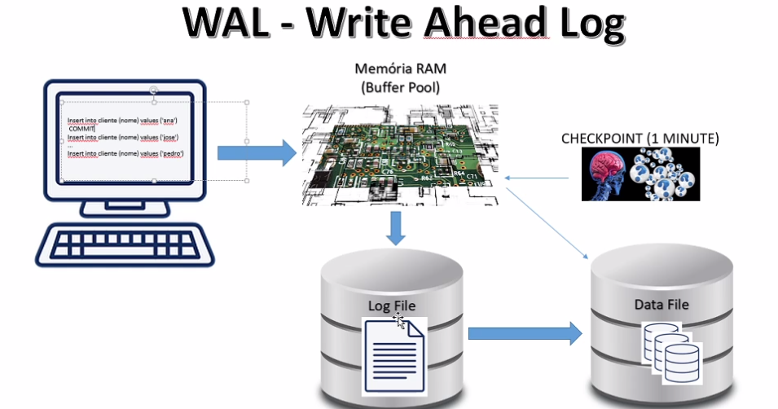

# Banco de Dados _ SQLSERVER

### Visão geral das bases de dados de Sistema do SQL SERVER

### 📌 **Resumo**

Essas bases são indispensáveis para a operação do SQL Server.

- **master** → Controla a instância do SQL Server.
- **model** → Modelo para novos bancos.
- **msdb** → Agendamento e automação.
- **tempdb** → Armazena dados temporários.
- **Resource** → Objetos do sistema.

💡 **Dica:** Sempre faça backup das bases `master`, `msdb` e `model`, pois a perda dessas pode causar sérios problemas de recuperação do SQL Server.

 

 **Stored Procedures** 

### OverView sobre criação de uma Base de Dados

### **Criar o Banco via Interface Gráfica (SSMS)**

1. Abrir o **SQL Server Management Studio (SSMS)**.
2. Conectar-se ao servidor.
3. Clicar com o botão direito em **Databases (Bancos de Dados) > New Database**.
4. Definir o nome do banco e configurar opções como armazenamento e crescimento automático.
5. Clicar em **OK** para criar o banco.

### **Criar o Banco via T-SQL (`CREATE DATABASE`)**

O código abaixo cria um banco de dados básico:

```sql
sql
Copiar código
CREATE DATABASE EmpresaDB;

```

🔹 **Com parâmetros personalizados:**

```sql
sql
Copiar código
CREATE DATABASE EmpresaDB
ON
(
    NAME = 'EmpresaDB_Data',
    FILENAME = 'C:\SQLServer\Data\EmpresaDB.mdf',
    SIZE = 10MB,
    MAXSIZE = 50MB,
    FILEGROWTH = 5MB
)
LOG ON
(
    NAME = 'EmpresaDB_Log',
    FILENAME = 'C:\SQLServer\Data\EmpresaDB.ldf',
    SIZE = 5MB,
    MAXSIZE = 25MB,
    FILEGROWTH = 2MB
);

```

📌 **Explicação:**

- `ON` → Define os arquivos de dados (`.mdf`).
- `LOG ON` → Define os arquivos de log (`.ldf`).
- `SIZE` → Tamanho inicial.
- `MAXSIZE` → Tamanho máximo.
- `FILEGROWTH` → Crescimento automático.

A criação de um banco de dados pode ser feita tanto pela interface gráfica quanto via código T-SQL. Para tarefas simples, o **SSMS** é mais intuitivo, enquanto o **T-SQL** oferece mais controle e flexibilidade.

💡 **Dica:** Para projetos maiores, prefira **T-SQL**, pois facilita a automação e padronização do banco!

### Explicando WAL (LOG FILE)

O WAL é essencial para **bancos de dados transacionais**, garantindo que nenhuma transação confirmada seja perdida. Manter um bom gerenciamento do **arquivo de log** é fundamental para evitar problemas de desempenho e armazenamento



, 

### 📌 **Explicação**:

1. **`BEGIN TRAN`** → Inicia uma transação, permitindo agrupar múltiplas operações como uma única unidade de trabalho.
2. **`COMMIT TRAN`** → Confirma (grava permanentemente) todas as operações realizadas dentro da transação.

### 🛠️ **Exemplo de Uso**:

```sql
sql
Copiar código
BEGIN TRAN
    UPDATE Clientes SET Saldo = Saldo - 100 WHERE ID = 1;
    UPDATE Clientes SET Saldo = Saldo + 100 WHERE ID = 2;
COMMIT TRAN

```

🔹 Neste caso, se ambas as operações forem bem-sucedidas, elas serão confirmadas juntas. Se algo der errado (por exemplo, um erro na segunda `UPDATE`), nenhuma delas será aplicada, evitando inconsistências.

### ⚠️ **E se precisar reverter?**

Se quiser cancelar a transação caso ocorra um erro, você pode usar **ROLLBACK TRAN**:

```sql
sql
Copiar código
BEGIN TRAN
    UPDATE Clientes SET Saldo = Saldo - 100 WHERE ID = 1;

    -- Simulação de erro
    IF @@ERROR <> 0
    BEGIN
        ROLLBACK TRAN;
        PRINT 'Erro encontrado, transação revertida!';
        RETURN;
    END

    UPDATE Clientes SET Saldo = Saldo + 100 WHERE ID = 2;
COMMIT TRAN;

```

🔹 Se houver erro, o `ROLLBACK TRAN` desfaz todas as alterações realizadas dentro da transação.
